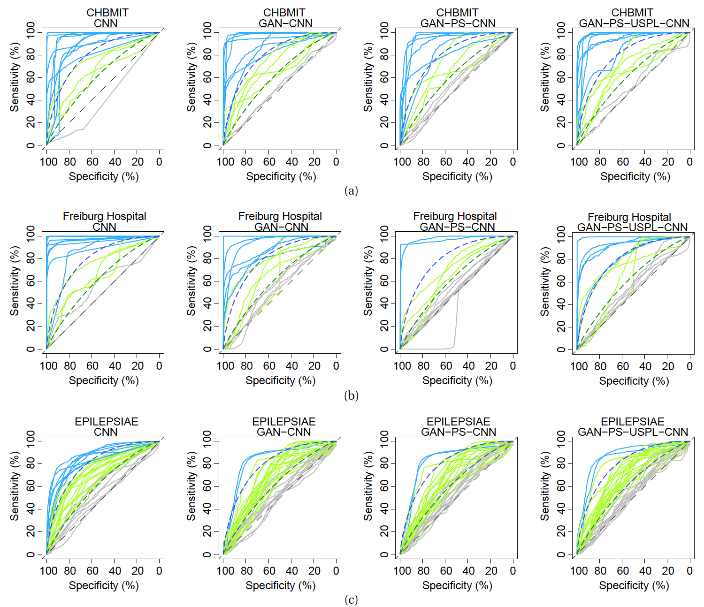

# Epileptic Seizure Forecasting with Generative Adversarial Networks

##### Code to reproduce results reported in our paper published as:
Truong, N. D., L. Kuhlmann, M. R. Bonyadi, D. Querlioz, L. Zhou, and O. Kavehei (2019). "Epileptic Seizure Forecasting with Generative Adversarial Networks." _IEEE Access_, accepted with minor revisions.


*Receiver operating characteristics (ROC) curves of seizure forecasting performance testing for different patients of
the three datasets: (a) - the CHB-MIT sEEG dataset, (b) - the Freiburg Hospital iEEG dataset, and (c) - the EPILEPSIAE
sEEG dataset. Each line corresponds to one patient. Above the green dash line: good performance; above the blue dash
line: very good performance.*

#### Requirements

* hickle==3.4.3
* six==1.12.0
* tensorflow_gpu==1.12.0
* scipy==1.0.1
* np_utils==0.5.10.0
* pandas==0.24.2
* stft==0.5.2
* numpy==1.11.0
* mne==0.11.0
* scikit_learn==0.21.3

#### How to run the code
1. Set the paths in \*.json files. Copy files in folder "copy-to-CHBMIT" to your CHBMIT dataset folder.

2. Prepare preprocessed data for DCGAN training. A large storage is required.
```python
python3 main.py --mode save_STFT --dataset DATASET
```
* DATASET can be FB, CHBMIT or EpilepsiaSurf (auxiliary files for EPILEPSIA Surface dataset are not uploaded here, available upon request) .

3. Train DCGAN model.
```python
python3 main.py --mode dcgan --dataset DATASET
```

4. Leave-one-seizure-out cross-validation.
```python
python3 main.py --mode cvgan --dataset DATASET
```
